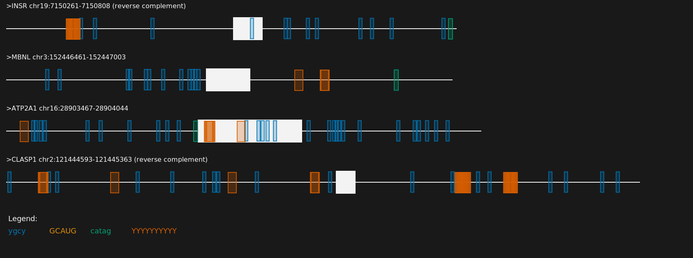

## motif-mark | A command line utility to visualize protein binding motifs along with exon and introns    

*How to use:*   

` conda create --name motif-mark`    
` conda activate motif-mark`   
` conda install -c conda-forge pycairo`   
` conda install -c conda-forge seaborn` 

*Versions:*     
`pycairo 1.20.1`   
`seaborn-0.11.2`   
`python  3.10.2`   

### How to create figures   

`> python3 motif-mark-oop.py -f [Fasta file] -m [Motif file] [Optional arguments]`   

### Example output : 

  

### Additional Options :

 Light mode output:   
`python3 motif-mark-oop.py -f [Fasta file] -m [Motif file] -l`  
Scale the nucleotides by a factor x:   
`python3 motif-mark-oop.py -f [Fasta file] -m [Motif file] -s x`
