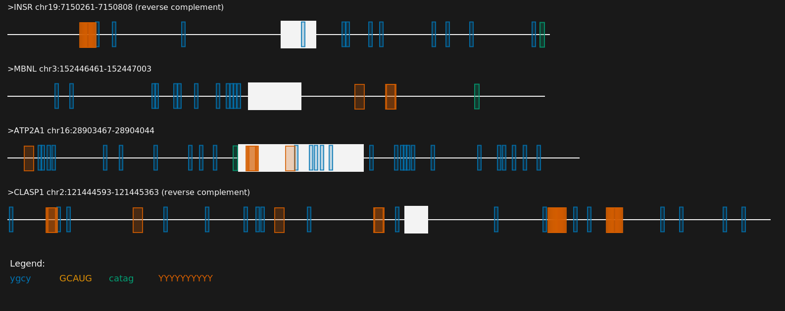

## motif-mark | A command line utility to visualize protein binding motifs along with exon and introns    

*How to use:*   

```
conda create --name motif-mark    
conda activate motif-mark   
conda install -c conda-forge pycairo  
conda install -c conda-forge seaborn
``` 


*Versions:*     
```
pycairo 1.20.1  
seaborn-0.11.2 
python  3.10.2 
```

### How to create figures   

`> python3 motif-mark-oop.py -f [Fasta file] -m [Motif file] [Optional arguments]`   

The input file should be a standard <a href="https://en.wikipedia.org/wiki/FASTA_format">fasta file</a> format. The motif file should contain a list of protein binding motifs which should be a string of <a href="https://en.wikipedia.org/wiki/Nucleic_acid_notation#IUPAC_notation">IUPAC nucleotide bases</a>.

### Example output : 

  


### Additional Options :

 Light mode output:   
`python3 motif-mark-oop.py -f [Fasta file] -m [Motif file] -l`  
Scale the nucleotide length by a factor x:   
`python3 motif-mark-oop.py -f [Fasta file] -m [Motif file] -s x`
